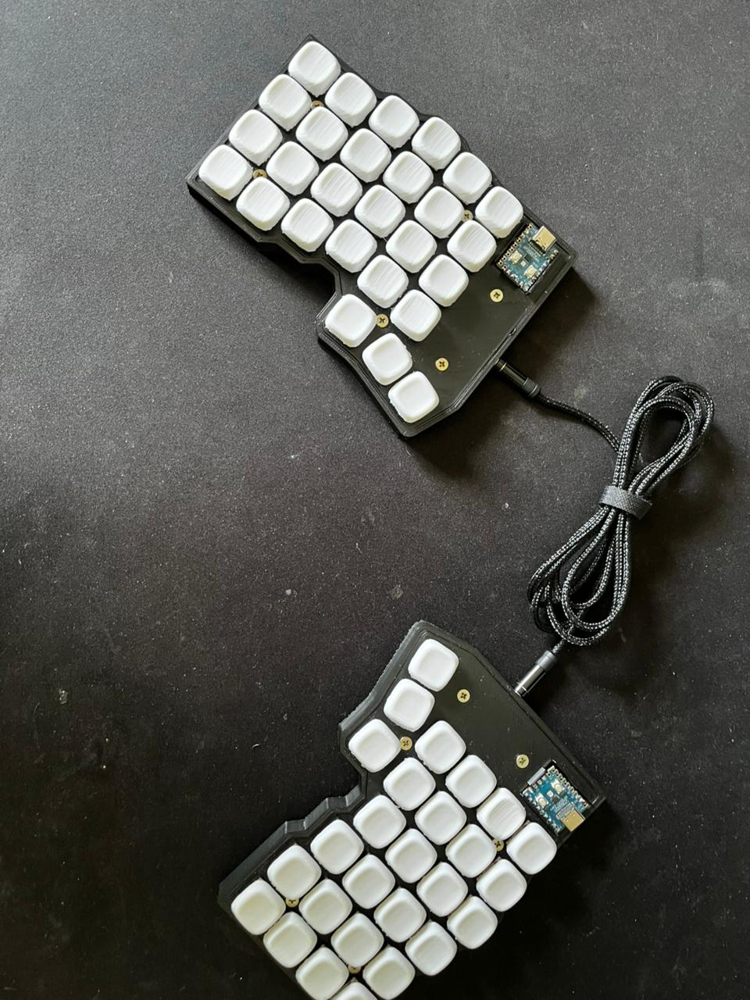
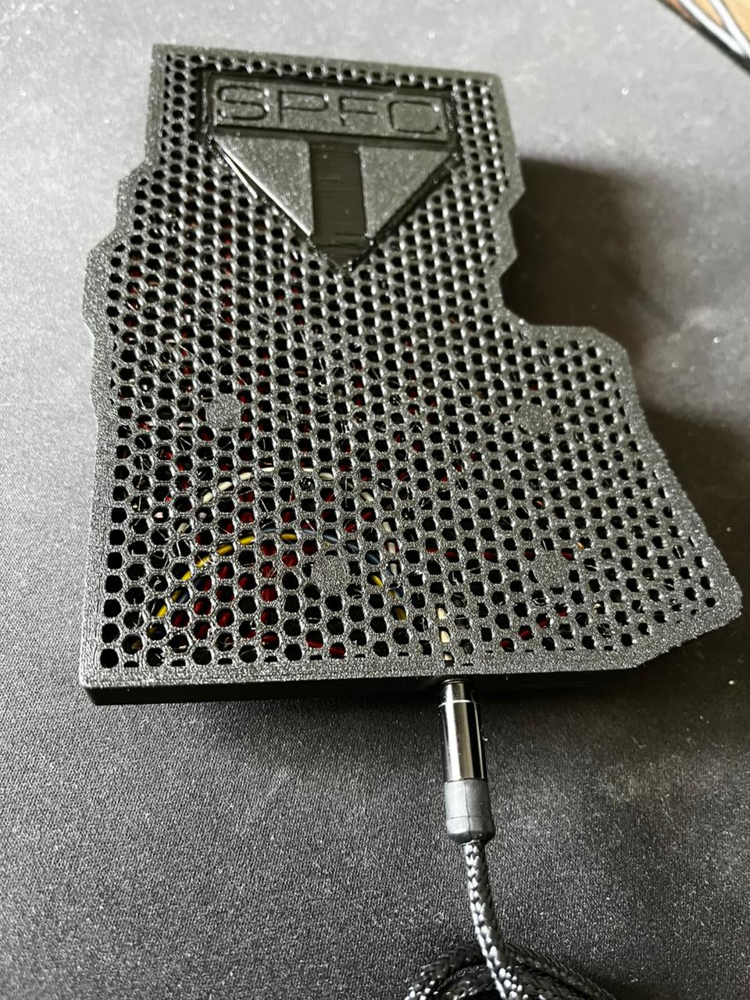

# Tchaikeebs

**Tchaikeebs** é um teclado *low profile* **6x4+3 (54 teclas)**, totalmente **impresso em 3D (PLA)** e **handwired**, com a logo do **SPFC** gravada na parte inferior.

---

## Especificações

- Layout: 6x4 + 3 teclas (54 no total)
- Conexão: TRRS (split com 2 controladores)
- Controladores: 2 × RP2040 Zero
- Montagem: totalmente handwired
- Estrutura: impressa em 3D (PLA)

---

## Materiais Utilizados

| Quantidade | Item | Observações |
|-------------|------|-------------|
| **2 kg** | Filamento PLA | Impressão da case e keycaps |
| **12** | Insertos M3x6 | Para fixação da case |
| **12** | Parafusos M3x6 | Compatíveis com os insertos |
| **2** | RP2040 Zero | Um para cada metade do teclado |
| **1** | Cabo TRRS | Conexão entre as metades |
| **2** | Sockets TRRS | Um em cada lado |
| **54** | Keycaps low profile | Usei [KLP Lame Keycaps](https://github.com/braindefender/KLP-Lame-Keycaps) (PLA) |
| **54** | Switches low profile Redragon |  |
| **54** | Diodos 1N4148 | Para matriz de teclas |
| **10 m** | Fio de cobre 16 AWG | Sem esmalte (melhor para linhas principais) |
| **10 m** | Fio de cobre 28 AWG | Resistente a calor, para ligações finas |
| **1 m** | Tubo termo retrátil | Isolamento e acabamento |
| **1** | Cabo USB-C (dados) | Para conexão ao PC |

---

## Ferramentas Recomendadas

- Ferro de solda (preferencialmente com **temperatura ajustável**)  
- Estanho 0.8 mm  
- Alicate e pinça  
- **Terceiro braço** de solda (*opcional, mas muito útil*)  
- Outras ferramentas básicas de soldagem  

---

## Como Montar

### 1. Impressão 3D
1. Baixe os arquivos STL da case. (Vou adicionar o STL mais tarde)
2. Imprima as peças em **PLA**.
3. Após a impressão, faça o **encaixe a seco** para testar a montagem antes de parafusar.

---

### 2. Instalação dos Insertos e Parafusos
1. Aqueça os **insertos M3x6** com o ferro de solda (~200–220 °C).  
2. Insira-os com cuidado nos furos da base até ficarem nivelados.  
3. Após esfriar, teste o encaixe dos parafusos M3x6.

---

### 3. Montagem da Matriz
1. Solde um **diodo 1N4148** em cada switch (atenção à polaridade).
2. Monte a **linha (row)** e **colunas (column)**  com fio 16 AWG — fios mais grossos facilitam a rigidez.  

---

### 4. Controladores e TRRS
1. Solde os **sockets TRRS** em cada metade.
2. Conecte o **RP2040 Zero** com os fios correspondentes da matriz.  
3. Fixe os controladores dentro da case com cola quente ou fita dupla-face.  
4. Conecte as metades com o **cabo TRRS**.
5. Use super bonder no socket para ficar bem firme.

---

### 5. Teste e Firmware
1. Conecte o teclado via USB-C.  
2. Teste todas as teclas e ajuste o layout conforme desejar.

---

## 🖼️ Imagens

| Vista superior |
|----------------|
|  |
|  |

---

## Notas

- Use **filamento PLA de boa qualidade** para garantir encaixes precisos.  
- A logo do **SPFC** foi adicionada na parte inferior como detalhe estético.
- Pode ser facilmente adaptado para outros microcontroladores compatíveis com **QMK** e **Vial**.  

---

## Firmware

- Compatível com **QMK** e **Vial**.
- Para personalização via **Vial**, é necessário desbloquear o firmware usando o combo definido em `config.h`.

---

## Créditos

- Keycaps usadas: [KLP Lame Keycaps](https://github.com/braindefender/KLP-Lame-Keycaps).
- Inspiração: [Silakka54](https://github.com/Squalius-cephalus/silakka54).
